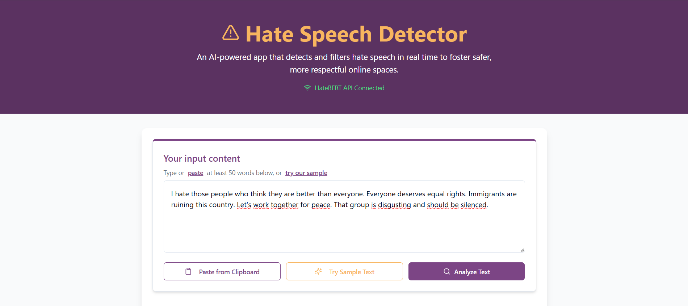
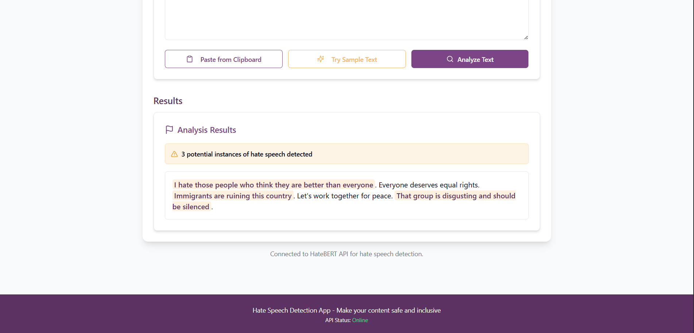

<p align="center">
    
</p>

## 🚀 Features

- 🔍 Real-time hate speech detection
- 🌐 Interactive React-based frontend
- 🧠 ML model hosted on Hugging Face Hub
- 🐍 Flask API for backend inference
- 📊 Confidence score for predictions


## 🧠 Model

The detection model is trained on Hate Speech and Offensive Language Dataset and fine-tuned for binary/multiclass classification (e.g., hate, offensive, neither). Hosted publicly on Hugging Face:

- **Model Name:** `KhalidGB/HateBERT`
- **Model Card:** [View on Hugging Face](https://huggingface.co/KhalidGB/HateBERT)

## 🖼️ Demo

> Try the model directly on [Hugging Face 🤗](https://huggingface.co/KhalidGB/HateBERT)

<p align="center">
    
</p>

<p align="center">
    
</p>

```bash
hate-speech-detector/
│
├── venv/       
├── model/        # Fine-tuned hugging face model
│   └── config.json
    └── model.safetensors
    └── special_tokens_map.json
    └── tokenizer_config.json
    └── training_args.bin
    └── vocab.txt
├── README.md
├── app.py
└── requirements.txt
└── LICENSE
└── README.md
```
make sure you download The HateBERT model from Hugging Face into model folder


## ⚙️ Installation

### Backend (Flask)

```bash
python -m venv venv
source venv/bin/activate #Mac
venv\Scripts\activate    #Windows
pip install -r requirements.txt
flask run
```

### Frontend (React)
```bash
cd frontend
npm install
npm run dev
```
Make sure the backend is running on http://localhost:5000 and frontend on http://localhost:8080.
